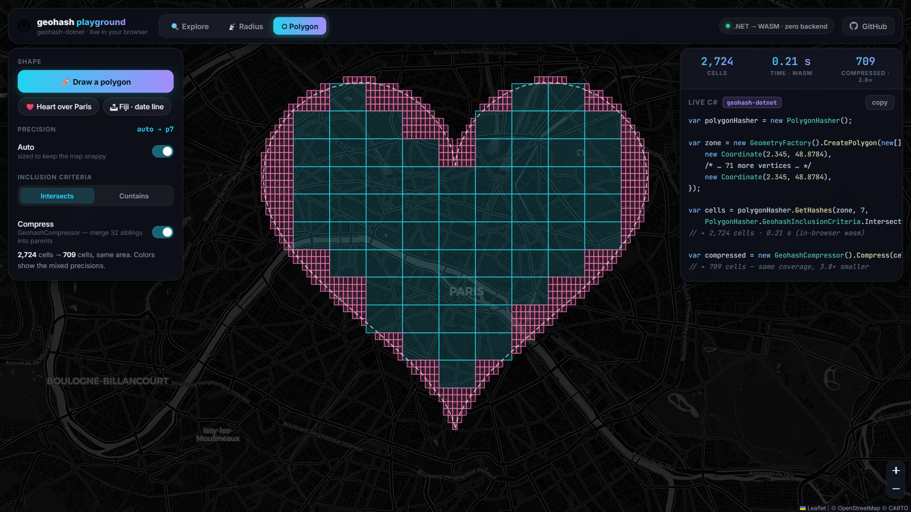

# geohash-dotnet 

Fast, dependency-light geohashing for .NET — encode, decode, neighbors,
polygon coverage, **radius search**, and compression. Handles the ugly parts
(antimeridian, poles, date-line wrapping) correctly, with the test suite to prove it.

[](https://www.nuget.org/packages/geohash-dotnet) [](https://www.nuget.org/packages/geohash-dotnet)

```
dotnet add package geohash-dotnet
```

> **v3** is a major rewrite — hot paths are allocation-free, polygon hashing is
> 10–50× faster via prepared geometries, and radius/circle search is new.
> Developed with the support of **Claude Fable 5** (Anthropic), including the
> discovery and fix of a subtle nearest-point bug near the poles. 🤖

🛝 **[Try it live in the browser playground →](https://postlagerkarte.github.io/geohash-dotnet/)**
the full library running in your tab via WebAssembly, nothing to install.
New to geohashes? Take the **[60-second guided tour](https://postlagerkarte.github.io/geohash-dotnet/#tour)** —
the map explains the whole idea by performing it.

## 30-Second Tour

```csharp
var geohasher = new Geohasher();

string hash = geohasher.Encode(52.5163, 13.3777, precision: 7);   // "u33db2m"
var (lat, lng) = geohasher.Decode("u33db2m");                     // cell center
BoundingBox box = geohasher.GetBoundingBox("u33db2m");            // exact cell bounds

string east = geohasher.GetNeighbor("u33db2m", Direction.East);   // adjacent cell
Dictionary<Direction, string> all8 = geohasher.GetNeighbors("u33db2m");

string parent = geohasher.GetParent("u33db2m");                   // "u33db2" (coarser)
string[] children = geohasher.GetSubhashes("u33db2m");            // 32 finer cells
```

## 🎯 Radius Search (new)

Cover a circle with geohash cells — the building block for every
*"find things near me"* feature:

```csharp
var radiusHasher = new RadiusHasher();

// All precision-7 cells within 2 km of the Brandenburg Gate
var cells = radiusHasher.GetHashes(52.5163, 13.3777, 2_000, geohashPrecision: 7);

// Or let the library pick a sensible precision for the radius
var auto = radiusHasher.GetHashes(52.5163, 13.3777, 2_000);

// Distance helpers included
double meters = RadiusHasher.GetDistanceMeters("u33db2m", "u33dc0k");
int precision = RadiusHasher.GetPrecisionForRadius(150);  // → cell size ≈ your radius
```

### Use case: proximity search on a plain database

No PostGIS, no extensions — just a string prefix index:

```csharp
// "Show restaurants within 1.5 km" against any SQL/NoSQL store:
var cells = radiusHasher.GetHashes(userLat, userLng, 1_500, 6);

// WHERE geohash6 IN (@cells)  →  candidate rows
// Then rank the few survivors by exact distance:
var nearby = candidates
    .Select(r => (r, d: RadiusHasher.GetDistanceMeters(userLat, userLng, r.Lat, r.Lng)))
    .Where(x => x.d <= 1_500)
    .OrderBy(x => x.d);
```

### Use case: geofence alerting

```csharp
// Precompute once: cells fully inside the alert zone vs. boundary cells
var inner = radiusHasher.GetHashes(zoneLat, zoneLng, 500, 8, GeohashInclusionCriteria.Contains);
var edge  = radiusHasher.GetHashes(zoneLat, zoneLng, 500, 8, GeohashInclusionCriteria.Intersects);
edge.ExceptWith(inner);

// Per GPS ping: O(1) hash lookup, exact math only for boundary cells
string cell = geohasher.Encode(ping.Lat, ping.Lng, 8);
bool inside = inner.Contains(cell)
    || (edge.Contains(cell) && RadiusHasher.GetDistanceMeters(zoneLat, zoneLng, ping.Lat, ping.Lng) <= 500);
```

Works correctly across the antimeridian and over the poles — a 100 km circle
at (89.5°, 0°) knows the shortest path to a cell at 179°E goes *across the pole*,
not around the parallel.

## 🗺 PolygonHasher

Cover any (NetTopologySuite) polygon — city limits, delivery zones, country borders:

```csharp
var polygonHasher = new PolygonHasher();

var zone = new Polygon(new LinearRing(new[] {
    new Coordinate(-122.4183, 37.7755), new Coordinate(-122.4183, 37.7814),
    new Coordinate(-122.4085, 37.7814), new Coordinate(-122.4085, 37.7755),
    new Coordinate(-122.4183, 37.7755)
}));

var cells = polygonHasher.GetHashes(zone, 7,
    PolygonHasher.GeohashInclusionCriteria.Intersects,
    progress: new Progress<double>(p => Console.Write($"\r{p:P0}")),
    cancellationToken: ct);
```

Antimeridian-crossing polygons (Fiji, Chukotka, the Pacific) are split and
handled automatically.

## 🗜 GeohashCompressor

Shrink a covering to the minimal equivalent set — 32 sibling cells collapse
into their parent, recursively:

```csharp
var compressor = new GeohashCompressor();

var cells = polygonHasher.GetHashes(cityPolygon, 8);   // e.g. 48,000 cells
var minimal = compressor.Compress(cells);              // e.g. 1,900 cells, same area
```

Perfect before persisting coverings or shipping them to clients.

## 🤖 For AI Agents & Codegen

This library is deliberately friendly to automated callers:

- **Stateless & thread-safe** — every class can be a singleton; no setup, no config, no I/O.
- **Deterministic** — same input, same output, every platform.
- **Strict validation** — invalid input throws `ArgumentException`/`ArgumentOutOfRangeException`
  with actionable messages (including *what to change*), never silent garbage.
- **Self-describing API** — full XML docs on every member; signatures below.

```
Geohasher          : Encode(lat,lng,precision) | Decode(hash) | GetBoundingBox(hash)
                     GetNeighbor(hash,dir) | GetNeighbors(hash) | GetParent(hash)
                     GetSubhashes(hash) | IsValid(hash)
RadiusHasher       : GetHashes(lat,lng,radiusM[,precision][,criteria])
                     GetDistanceMeters(a,b) | GetPrecisionForRadius(radiusM)
                     GetCellSizeMeters(precision[,lat])
PolygonHasher      : GetHashes(polygon,precision[,criteria][,progress][,ct])
GeohashCompressor  : Compress(hashes[,minLevel][,maxLevel])
Precision          : named constants, e.g. Precision.Size_km_1x1 == 6
```

## ⚡ Performance

- `Encode`/`Decode`: allocation-free hot path (stackalloc + O(1) lookup tables).
- `RadiusHasher`: one haversine term per candidate cell, no `asin`/`sqrt` in the
  loop — typical queries complete in **microseconds**.
- `PolygonHasher`: prepared-geometry spatial index + arithmetic cell bounds;
  parallelized per row. Country-sized polygons at precision 6–7 run in seconds.
- `GeohashCompressor`: O(n log n) — sort once, single-pass prune, level-wise merge.

Each precision level multiplies cell count by 32 — choose the coarsest
precision your use case tolerates (`Precision` constants or
`RadiusHasher.GetPrecisionForRadius` help).

## 🛝 Playground

Everything above, interactive: **[postlagerkarte.github.io/geohash-dotnet](https://postlagerkarte.github.io/geohash-dotnet/)** —
hover to encode live, cover circles and polygons, compress coverings, and copy
the exact C# for whatever you just did. The library runs in your browser via
WebAssembly; the timings you see are real.

[](https://postlagerkarte.github.io/geohash-dotnet/)

Source in [`playground/`](playground/) — run locally with `dotnet run --project playground`.

## License & Credits

MIT. v3 rewrite, radius search, and test suite developed with the support of
**Claude Fable 5** by Anthropic.
